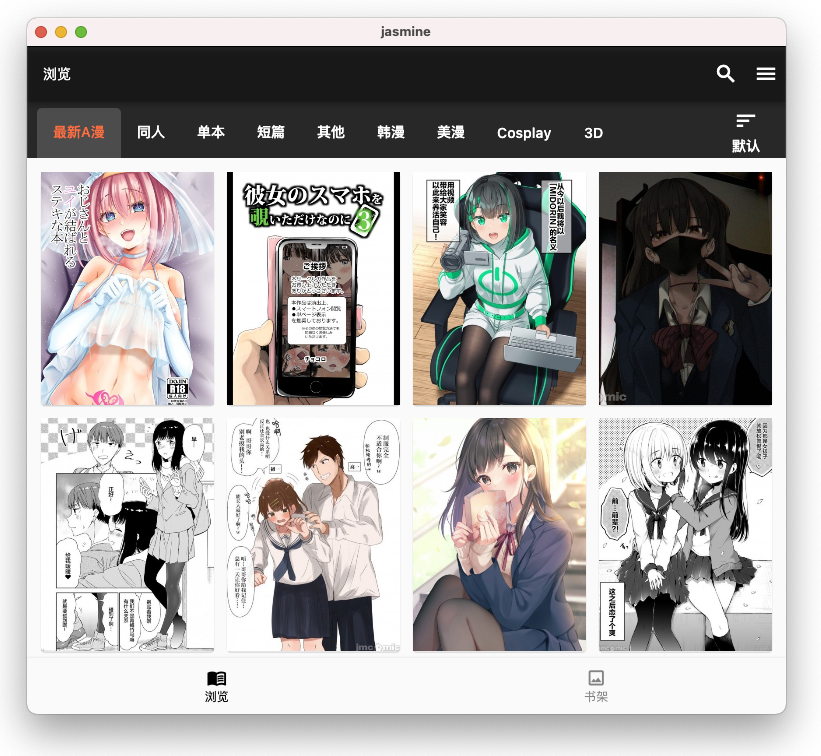

<div align="center">
  <h1 align="center">jmtt2</h1>
  <p>禁漫天堂第三方客户端（Flutter + Rust）</p>
  <p>基于上游开源项目 <a href="https://github.com/niuhuan/jenny">jenny / Jasmine</a> v1.7.21 逆向定制</p>
</div>

---

## 功能简介

- **浏览 / 搜索 / 收藏 / 下载**：完整保留上游全部能力（分类浏览、关键词搜索、收藏夹、批量下载、WebDAV 同步、多种阅读模式等）
- **屏蔽 Tag 设置**（jmtt2 新增）：设置页主界面直达；按名称 / 作者 / 简介 / 分类 / 子分类匹配，忽略大小写；搜索、分类浏览、排行、详情相关列表等**所有列表入口统一直接隐藏**命中条目
- **搜索排除语法**（jmtt2 新增）：搜索框内用 `-关键词` 排除，例如 `全彩 -人妻` = 搜索「全彩」但剔除含「人妻」的条目；排除词在请求前剥离，结果本地过滤，与常驻屏蔽名单叠加生效
- **封印内容隐藏**（jmtt2 改动）：上游「封印」机制原本只拦截点击，jmtt2 将封印条目从列表中直接隐藏
- **搜索框优化**（jmtt2 改动）：清空按钮重做为白色 X + 半透明圆底，亮暗主题下都清晰可见；修复输入文字错位感
- **设置页调整**（jmtt2 改动）：屏蔽 Tag 设置提升到设置主界面；「上游项目」致谢收纳为折叠分组

## 截图

#### Browser



#### Reader


## 上游项目

- **[jenny](https://github.com/niuhuan/jenny)** — niuhuan 开发的 Jasmine 客户端。jmtt2 的全部基础能力与工程架构均来自该项目及其分支 Jasmine，感谢上游作者的慷慨开源。

## 构建方式

标准 Flutter 工程（Flutter 3.29.3 / Dart 3.7.2）：

```bash
flutter pub get
flutter build apk --release
```

## 下载

最新版本见 [Releases](https://github.com/Aur5411/jmtt2/releases)：`jmtt2-vX.Y.Z.apk`（arm64-v8a）。

## 免责声明

本项目仅供学习与技术研究，不提供任何服务端；请于下载后 24 小时内自行删除，由此产生的风险与责任由使用者自行承担。
